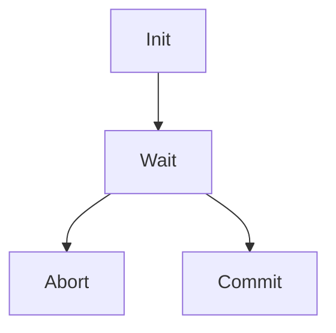

# GFSM - simple and fast Finite State Machine for Go

[](https://pkg.go.dev/github.com/astavonin/gfsm)


The GFSM library provides a simple and **fast** implementation of a Finite State Machine (FSM) for Go. The library adopts C++-style approaches with a primary focus on speed and simplicity, which is the main difference from alternative Go FSM implementations like [looplab/fsm](https://github.com/looplab/fsm).

# How To use GFSM

[Two Phase Commit protocol](https://en.wikipedia.org/wiki/Two-phase_commit_protocol) (TPC protocol) is an excellent example of Finite State Machine use case.

*NOTE: Full example is in [examples/two-phase-commit/main.go]() folder.*

Having the following State Machine:


 we should:
1. Enumerate all possible states
2. Describe each states
3. Describe a state machine
4. Run the state machine

## Enumerate all possible states

The GFSM library can consume any `comparable` interface as a states enumerator, but the recommended approach is using `int`-based types. For example, we can define type `State` with all TPC protocol-related states.

```go
type State int
const (
    Init State = iota
    Wait
    Abort
    Commit
)
```

## Describe each states

Each State is represented by its unique `stateID`, `action` handler, and list of possible `transitions`. Each state can have a unique handler that supports `StateAction` interface:

```go
type StateAction[StateIdentifier comparable] interface {
	OnEnter(smCtx StateMachineContext)
	OnExit(smCtx StateMachineContext)
	Execute(smCtx StateMachineContext, eventCtx EventContext) StateIdentifier
}
```
Where `OnEnter` and `OnExit` will be called once on the state entering or exiting respectfully, and `Execute` is the call that the state machine routes to the current state from `StateMachineHandler.ProcessEvent(...)`.

## Describe a state machine

Any State Machine can have its unique context. For the TPC protocol, it's important to have information about the voting process, like the expected voter count and committed ID.
```go
type coordinatorContext struct {
	commitID string
	partCnt  int
}
```
`StateMachineContext` is stored inside the constructed `StateMachineHandler` object and will be passed to each state on any calls (`OnEnter`, `OnExit`, and `Execute`).

To create a new state machine, `StateMachineBuilder` should be used. To build a TPC protocol state machine, you can use the following approach:

```go
sm := gfsm.NewBuilder[State]().
    SetDefaultState(Init).
    SetSmContext(&coordinatorContext{partCnt: 3}).
    RegisterState(Init, &initState{}, []State{Wait}).
    RegisterState(Wait, &waitState{}, []State{Abort, Commit}).
    RegisterState(Abort, &responseState{
        keepResp: Abort,
    }, []State{Init}).
    RegisterState(Commit, &responseState{
        keepResp: Commit,
    }, []State{Init}).
    Build()
```
## Run the state machine

After the construction, the state machine shall be executed and terminated on exit:

```go
sm.Start()
defer sm.Stop()
```

To process an event, the state machine object implements a `ProcessEvent(eventCtx EventContext) error` call, where `eventCtx` can be any data that the state will process internally as primary input data.

```go
err := sm.ProcessEvent(commitRequest{"commit_1"})
```

During the event processing, the state machine will call `Execute` with the passed `EventContext` and `StateMachineContext`. Based on these data, the state can decide either to keep the current state (`Init` in the example below) or make a switch (`Wait`) by returning the new expected state.

```go
func (s *initState) Execute(smCtx gfsm.StateMachineContext, eventCtx gfsm.EventContext) State {
	cCtx := smCtx.(*coordinatorContext)
	req, ok := eventCtx.(commitRequest)
	if !ok {
		// ...
		return Init
	}
	// ...
	return Wait
}
```
